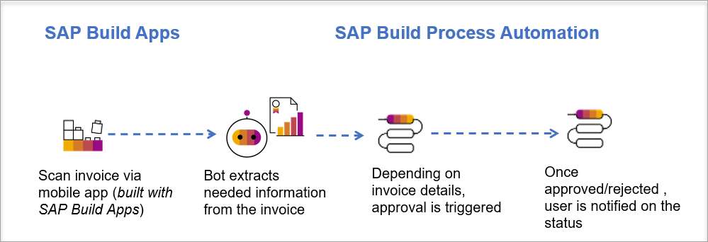

# AD160 - Build Robust Apps Enhanced with Process Automation and Low-Code Tooling

## Description

This repository contains the material for the SAP TechEd 2022 session called [AD160 - Build Robust Apps Enhanced with Process Automation and Low-Code Tooling](https://go3.events.sap.com/sapteched/hybrid/2022/reg/flow/sap/saptech2022/sapteched2022catalog/page/catalog/session/1661198448374001X6GH)

## Overview

This session introduces attendees how to build apps .processes with workflows and extract the invoice data  with RPA bots. Leverage pre-build sample content package and enhance the sample process to integrate with Apps. Finally test your integrated scenario .

Scenario : Invoice Approval withSAP Build Apps & SAP Build Process Automation

## Requirements

The requirements to follow the exercises in this repository is to know basic of SAP Build Process Automation. Attend this virtual workshop to learn how to build  process, decisions and extract the data from documents with RPA bots from scratch [AI180 - Automate Your Invoice Processing with SAP Build Process Automation](https://go3.events.sap.com/sapteched/hybrid/2022/reg/flow/sap/saptech2022/sapteched2022catalog/page/catalog/session/1661198041428001ExKO)

## Exercises

- [Exercise 1 - Create SAP Build Apps Project](/exercises/1_CreateAppGyverProject)
- [Exercise 2 - Install Desktop Agent 3](/exercises/7_7_Install_Desktop_Agent)
- [Exercise 3 - Import Sample Business Process From SAP Build Process Automation Store](/exercises/3_ImportSampleProcess)
- [Exercise 4 - Modify the Process](/exercises/4_CreateAPITrigger)
- [Exercise 5 - Modify Automation](/exercises/5_ModifyAutomation)
- [Exercise 6 - Release, Deploy and Test Business Process](/exercises/6_ReleaseDeployProcess)
- [Exercise 7 - Test SAP Build Apps and Business Process](/exercises/7_E2ETesting)

## How to obtain support

Support for the content in this repository is available during the actual time of the online session for which this content has been designed. Otherwise, you may request support via the [Issues](../../issues) tab.

## License
Copyright (c) 2022 SAP SE or an SAP affiliate company. All rights reserved. This project is licensed under the Apache Software License, version 2.0 except as noted otherwise in the [LICENSE](LICENSES/Apache-2.0.txt) file.
