# Create an SAP Build Apps Project

In this exercise, you will create a new SAP Build Apps Project to start creating the application.

## Create a New Project

1. Within the application development lobby, click <b>Create</b> and then select <b><i>SAP Build Apps Project</i></b>.

2. Under Project Name, enter <b><i>"Company Name Invoice Approval"</b></i>. For example, <i>Cafe Invoice Approval</i>.
Enter a short description for your reference. <b><i>"An application to Scan or upload invoice”</b></i>.  
Click on <b>Create</b> to start building your application.

## Create UI 
1. You will be redirected to SAP Build Apps Composer, which is like an IDE for SAP Build Apps. In the canvas, you can already see a <b>Title</b> and <b>Text</b> component.

2. Click on “<i>Headline</i>” on the canvas to select the <b>Title</b> component.
Now, the properties tab on the right-hand side will show the properties of the Title component
where you can modify this component.  Under <b>Content</b>, enter “<i>Invoice Approval</i>”

3. Select the <b>Text</b>, modify the content of the component under the properties on right-hand side to "<i>Enter your name and upload your invoice</i>".

4. Drag and drop a <b>Input field</b> from the <b>UI Component</b> library to the canvas.

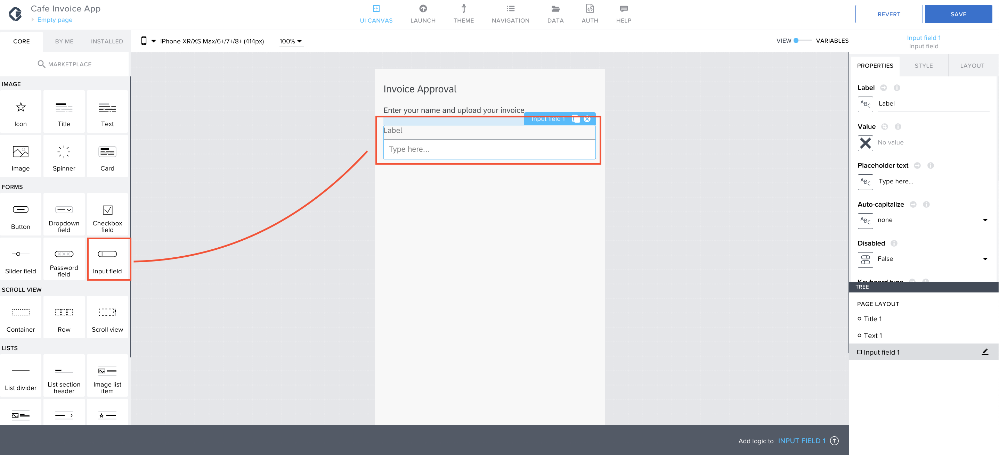

5. Under the properties of the Input field, clear the <b>Label</b> and change the placeholder text to "<i>Enter your name</i>".

6. Drag and drop a <b>Button</b> component from the component library on the left-hand side to the canvas.  Change the <b>Label</b> on the button in the properties tab of the button component to “<i>Upload your Invoice</i>”.

7. Drag and drop an <b>Image</b> component, to the canvas.

8. Switch to <b>Variables</b> view. 
In <b>Variables view</b>, you can create variables which can store information temporarily. 

9. Create an App Variable by clicking on <b>ADD APP VARIABLE</b> and rename it to "<i>name</i>".

10. Add another <b>App Variable</b> and rename it to "<i>Invoicescan</i>".

11. Change the <b>Variable Value Type</b> of <b>Invoicescan</b> to <b>Local filesystem path</b>.

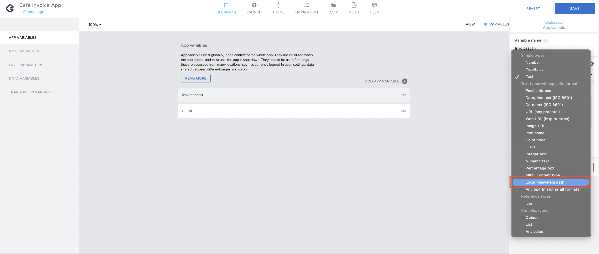

12. Switch back to <b>VIEW</b>.

13. Under the properties tab of <b>Input field component</b>, open the binding menu for <b>Value</b> by clickin on "<b>X</b>" icon.

14. The binding menu will pop-up. Select <b> Data and Variables</b>.

15. Select <b> App Variable</b>.

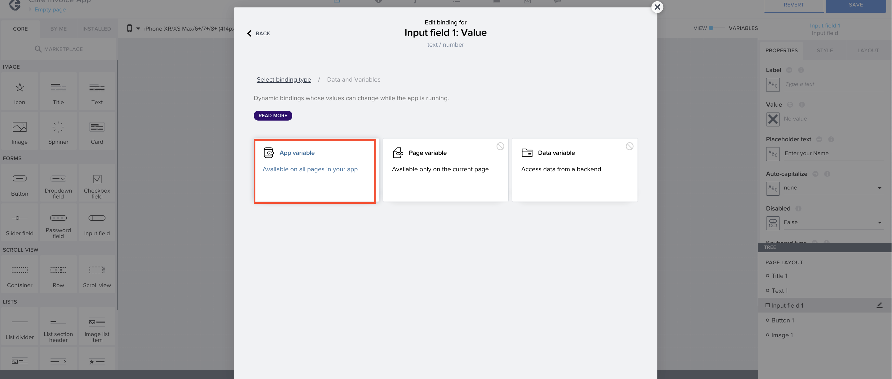

16. Now, select <b>name</b> in the list of App variables available.

17. Click on <b>SAVE</b> button to the save the binding to the component value.

18. A variable can be binded to this image component. Open the binding menu of the image under properties on the right-hand side.

19. The binding menu will be pop-up. Select <b>Data and Variables</b>.

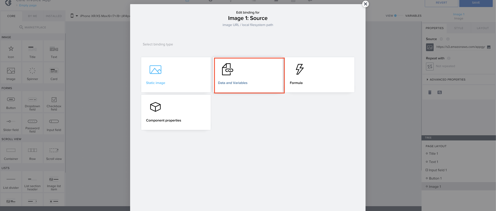

20. Select <b>App Variables</b>.

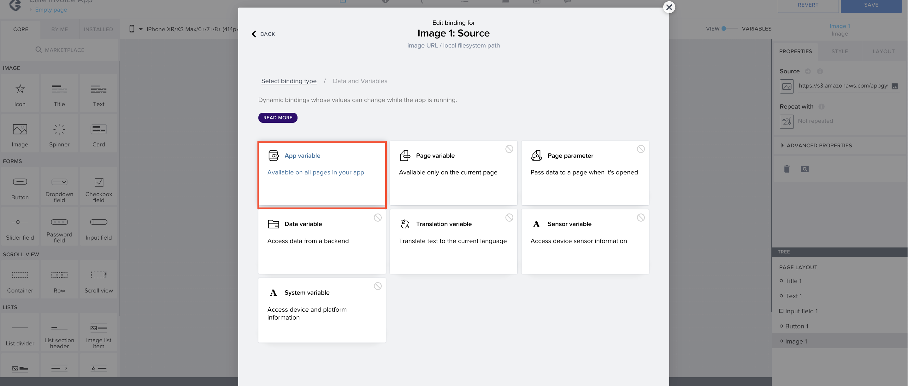

21. Now select <b>Invoicescan</b> under the list of available app variables and click on <b>SAVE</b> to save the binding to the image component.

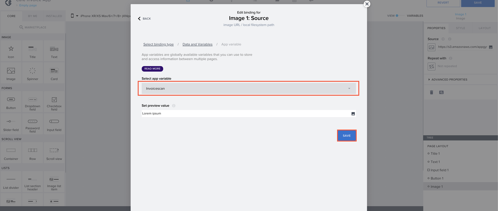

22. Drag and drop another <b>Button</b> component from component library to the canvas and rename the label to <b>Submit</b>.

23. The submit button should be visible only after the invoice is selected. Click on <b>ADDVANCED PROPERTIES</b> to change the visibility properties of the button. Open the binding menu for the visibility properites.

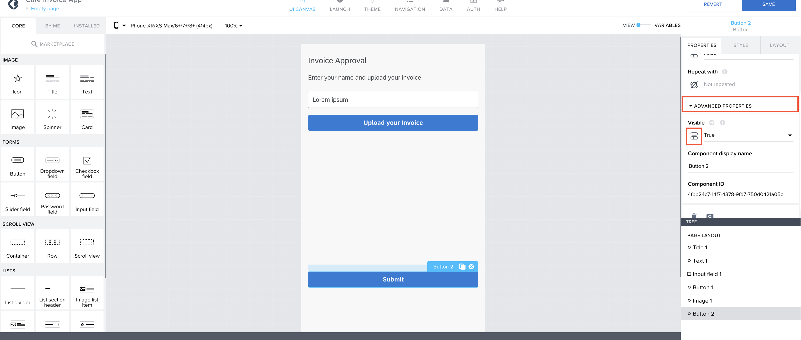

24. Select the <b>Formula</b>.

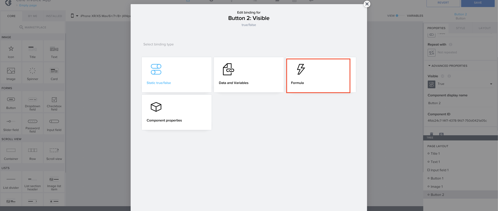

25. In the formula bar enter the following formula.
<pre>IF(IS_EMPTY(pageVars.InvoiceScan),false,true)</pre>
This formula checks if the <b>InvoiceScan</b> page variable is empty, then the output will be false and component will
be disabled. If the <b>InvoiceScan</b> page variable have some value, the output will change to
true, and component will be displayed. 
Click on <b>SAVE</b>.

26. Click on <b>SAVE</b>.

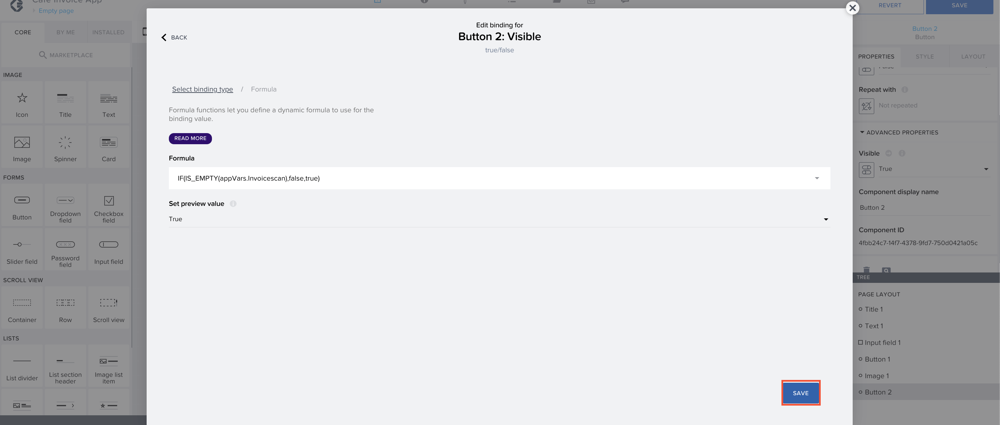

27. Click on <b>SAVE</b> on the top right corner to the save the UI created so far.

## Data Connection

## Create Logic

1. Open the logic composer for <b>Upload</b> button by click on the grey bar in the bottom

2. By default, the trigger event will be <b>Component tap</b>. 
Now we are going to download a new component from the <b>MARKETPLACE</b>.

<b>MARKETPLACE</b> contains hundreds of pre-built visual and logic components, which can be installed and used with minimum or no customisation.
 
more information on <a href="https://docs.appgyver.com/docs/marketplace?highlight=Market%20place">MARKETPLACE</a> 

3. In the search bar, search for “<i>pick image</i>”.  Now, select the <b>Pick image from library</b>component.

4. Click on <b>Install</b> to install the logic component in the library.

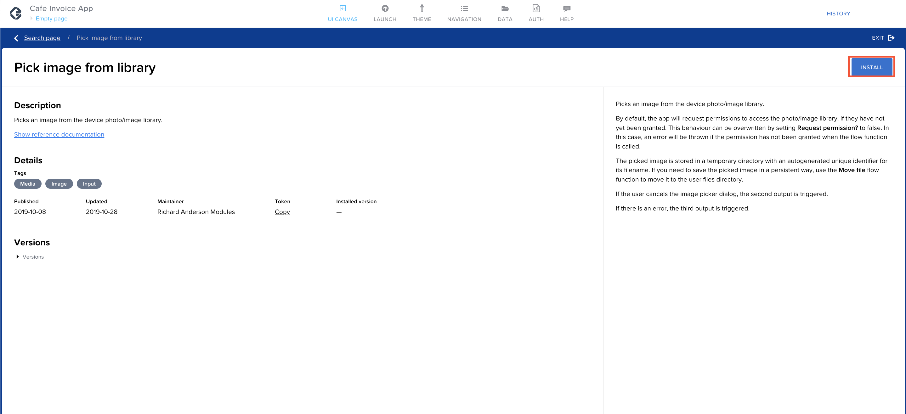

5. Drag and drop the <b>Pick image from library</b> under Installed tab to the logic canvas. 
Connect output node of the <b>Component tap</b> logic component with the <b>Pick image
from library</b>.

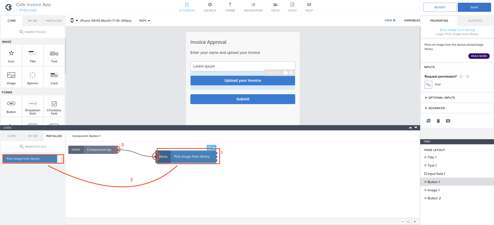

6. From the Core tab of the component library drag and drop the <b>Set app variable</b> component and connect the node of <b>Pick image from library</b> and <b>Set app variable</b>.

7. In the properties tab of the <b>Set app variable</b>, select the variable <b>Invoicescan</b>.
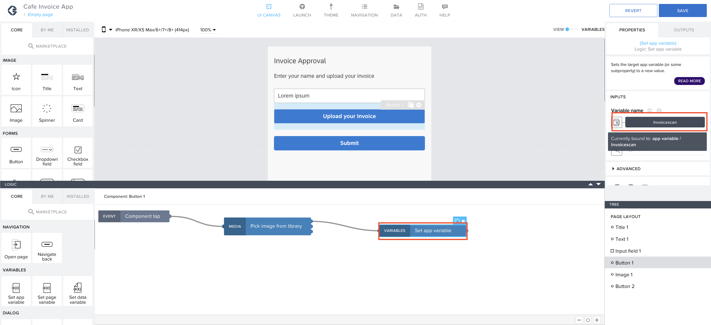
## Summary

Now that you have ...
Continue to - [Exercise 1 - Exercise 1 Description](../ex1/README.md)
