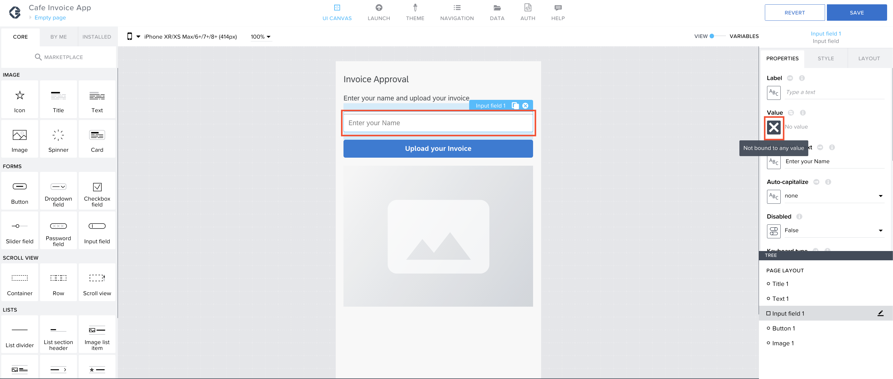
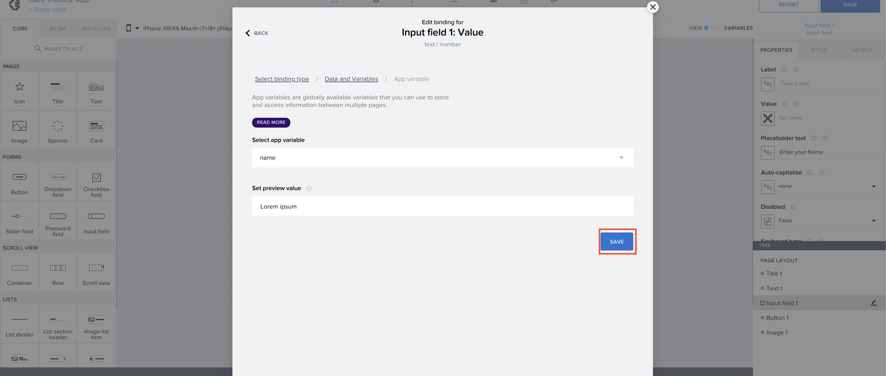
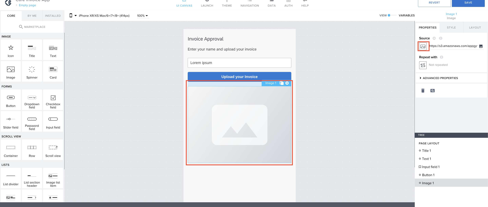

# Create an AppGyver Project

In this exercise, you will create a new AppGyver Project to start creating the application.

## Create a New Project

1. Within the application development lobby, click <b>Create</b> and then select <b><i>AppGyver Project</i></b>.

2. Under Project Name, enter <b><i>"Company Name Invoice Approval"</b></i>. For example, <i>Cafe Invoice Approval</i>.
Enter a short description for your reference. <b><i>"An application to Scan or upload invoice”</b></i>.  
Click on <b>Create</b> to start building your application.

## Create a Home Page
1. You will be redirected to AppGyver Composer, which is like an IDE for AppGyver. In the canvas, you can already see a <b>Title</b> and <b>Text</b> component.

2. Click on “<i>Headline</i>” on the canvas to select the <b>Title</b> component.
Now, the properties tab on the right-hand side will show the properties of the Title component
where you can modify this component.  Under <b>Content</b>, enter “<i>Invoice Approval</i>”

3. Select the <b>Text</b>, modify the content of the component under the properties on right-hand side to "<i>Enter your name and upload your invoice</i>".

4. Drag and drop a <b>Input field</b> from the <b>UI Component</b> library to the canvas.

5. Under the properties of the Input field, clear the <b>Label</b> and change the placeholder text to "<i>Enter your name</i>".

6. Drag and drop a <b>Button</b> component from the component library on the left-hand side to the canvas.  Change the <b>Label</b> on the button in the properties tab of the button component to “<i>Upload your Invoice</i>”.

7. Drag and drop an <b>Image</b> component, to the canvas.

8. Switch to <b>Variables</b> view. 
In <b>Variables view</b>, you can create variables which can store information temporarily. 

9. Create an App Variable by clicking on <b>ADD APP VARIABLE</b> and rename it to "<i>name</i>".

10. Add another <b>App Variable</b> and rename it to "<i>Invoicescan</i>".

11. Change the <b>Variable Value Type</b> of <b>Invoicescan</b> to <b>Local Systemfile path</b>.

12. Switch back to <b>VIEW</b>.

13. Under the properties tab of <b>Input field component</b>, open the binding menu for <b>Value</b> by clickin on "<b>X</b>" icon.

14. The binding menu will pop-up. Select <b> Data and Variables</b>.

15. Select <b> App Variable</b>.

16. Now, select <b>name</b> in the list of App variables available.

17. Click on <b>SAVE</b> button to the save the binding to the component value.

18. 

## Summary

Now that you have ...
Continue to - [Exercise 1 - Exercise 1 Description](../ex1/README.md)
