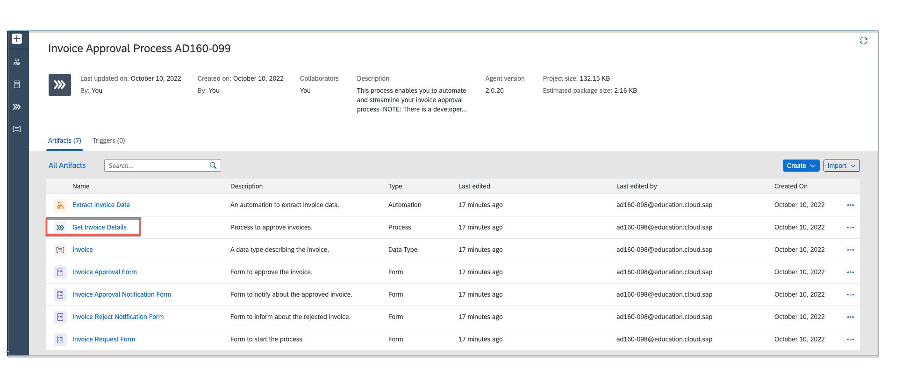
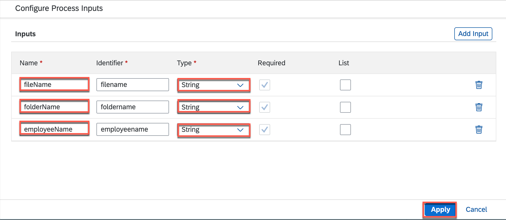
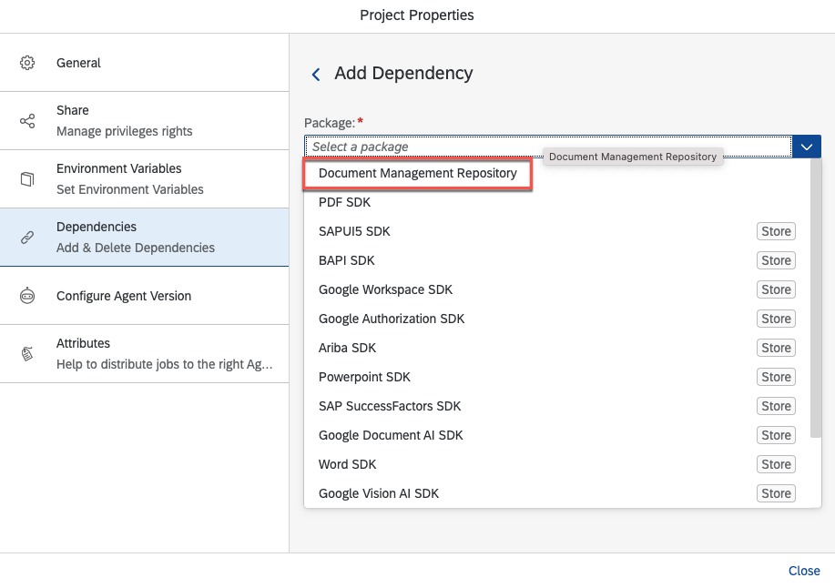

# Create the API Trigger

In this exercise you will learn:
- how to create an API Trigger

## 1. Modify the Project

1. Open your project. Choose process **Get Invoice Details**.

 

2. From the **Editable** version of the go to the **Invoice Request Form**, choose 3 dots and choose **Remove** to delete the form.

 

## 2. Configure the Inputs

1. Click on the **Canvas** in the background.

 

2. Choose **Configure Inputs** in **Inputs** to configure inputs.

 

3. Configure three inputs. Enter the names and choose types.

    |  **Name**    | **Type**
    |  :------------- | :-------------
    |  `fileName`       | string
    |  `folderName`     | string
    |  `employeeName`   | string

    **Apply** changes.

 

4. Select Project Properties.

 

5. Choose **Configure Agent Version** and select Agent 3.7 and **Save**.

 

6. Choose **Dependencies** and select **Add Dependency** button.

 

7. Under **Package** select **Document Management Repository**.

 

8. Select **Add** button.

 

8. **Close** the Project Properties window.

 

## Summary

You've now created API Triggers.

Continue to - [06](../ex3/run-release-deploy.md)
