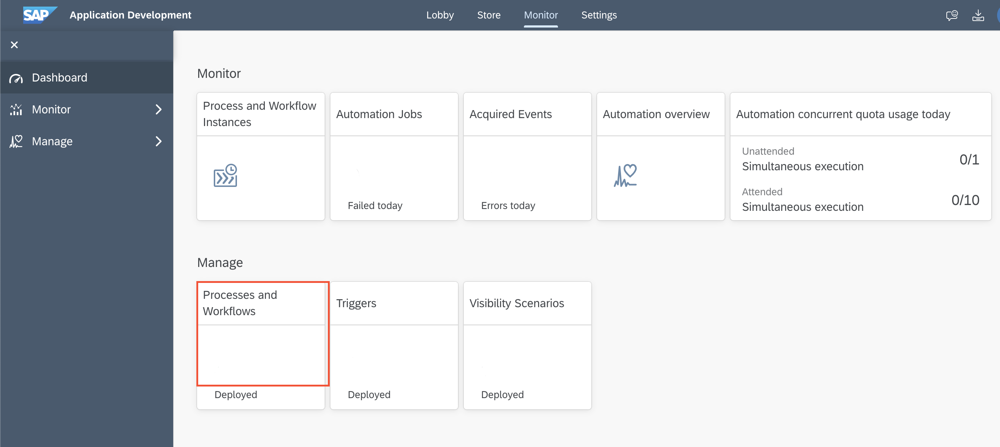
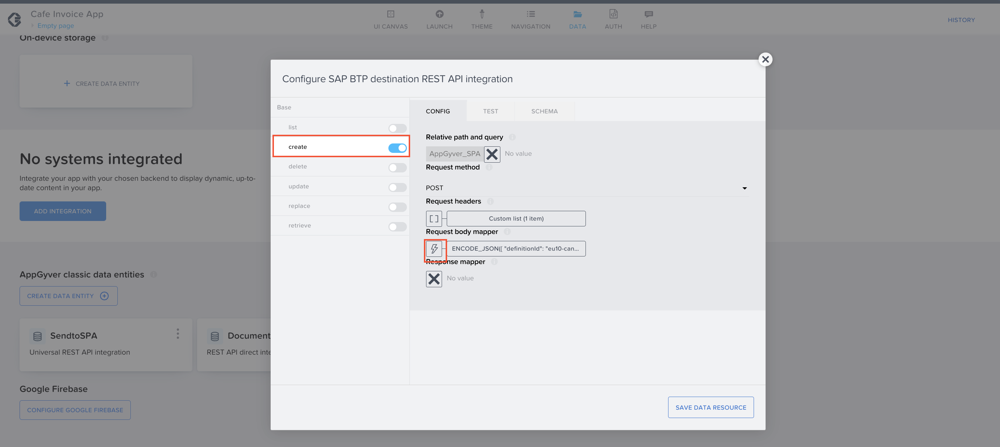
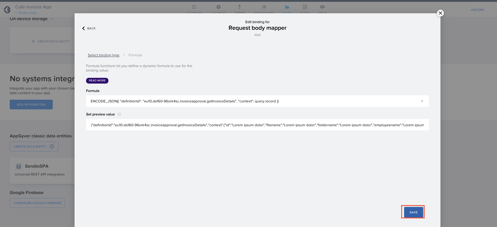
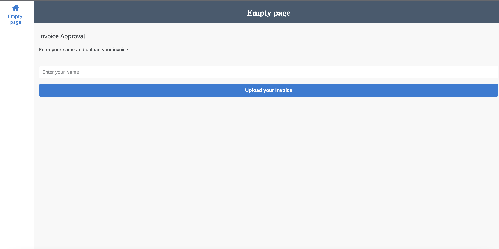

## Testing the End to End Scnerio.

1. Open the <b>Application lobby</b> again.  
    Open the <b>Monitor</b> tab.

2. Click on <b>Process and Workflow</b> Instances in the <b>Manage section</b>.

3. Find your process and copy its <b>Definition ID</b>.

4. Now, Open your AppGyver Project and click on <b>DATA</b> tab.

5. Select the <b>SendtoSPA</b> data entity.

6. In the <b>create</b> tab, open the bindng menu for <b> Request body mapper</b>.

7. Open the formula editor. Enter the following formula.
<pre>ENCODE_JSON({  "definitionId": "<b>Your Definition ID copied from SPA</b> ",  "context":  query.record })  </pre>
and click on <b>SAVE</b>.

8. Click on <b>SAVE</b>.

9. Now <b>SAVE DATA RESOURCE</b>.

10. Click on <b>SAVE</b> on the top right corner to the save the changes.

11. Now, open the <b>Launch</b> tab.

12. Click on <b> OPEN APP PREVIEW PORTAL</b>. 

13. Select the AppGyver project you created.

14. Enter the name and upload the invoice to test the process.
The invoice can be downloaded here <a href="">Inovice</a>.

