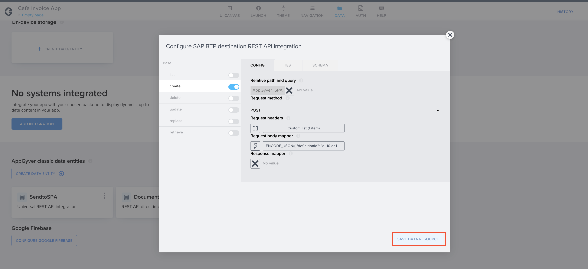
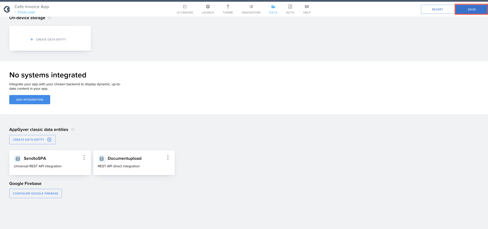
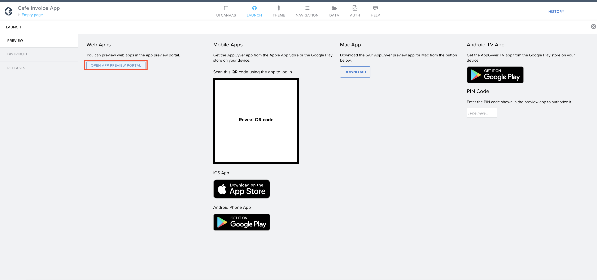

## Table of Contents
- [Overview](#overview)
- [Definition ID from SAP BUILD PROCESS AUTOMATION](#SPA)
- [Definition ID to SAP BUILD APPS](#build)
- [Testing the Scenerio](#Test)

## Testing the End to End Scnerio. 
Although, your application is connected to SAP Build Process Automation service, it is not connected to the process you created yet. In this stage, you will see how to connect your app and process.

## Copy Definition ID from SAP BUILD PROCESS AUTOMATION 
1. Open the <b>Application lobby</b> again.  
    Open the <b>Monitor</b> tab.  

2. Click on <b>Process and Workflow</b> under the <b>Manage </b> section.  

3. Search for your project name under <b>Project</b>. Select the project you created with the ID provided to you. Ex: <b>Invoice Process AD160-XXX</b>.  

4. After you find your process, copy its <b>Definition ID</b>.  

## Enter the Definition ID in SAP Build Apps. 

1. Now, Open your AppGyver Project and click on <b>DATA</b> tab.   

2. Select the <b>SendtoSPA</b> data entity.  

3. In the <b>create</b> tab, open the bindng menu for <b> Request body mapper</b>.  

4. Open the formula editor. Enter the following formula. <pre>ENCODE_JSON({  "definitionId": "<b>Your Definition ID copied from SPA</b> ",  "context":  query.record })  </pre>
and click on <b>SAVE</b>.  

5. Click on <b>SAVE</b>.  

6. Now <b>SAVE DATA RESOURCE</b>.  

7. Click on <b>SAVE</b> on the top right corner to the save the changes.

## Testing the Scenerio 

1. Now, open the <b>Launch</b> tab.  

2. Click on <b> OPEN APP PREVIEW PORTAL</b>.  

3. Select the AppGyver project you created.  

4. Enter the name and upload the invoice to test the process.
The invoice can be downloaded here <a href="https://github.com/SAP-samples/teched2022-AD160/blob/main/exercises/1_CreateAppGyverProject/images/Invoice.png?raw=true">Invoice</a>.

## summary

You

